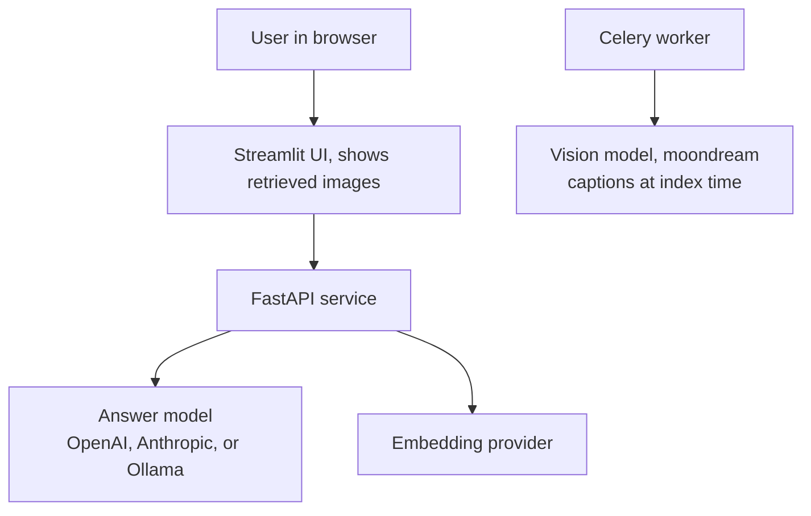
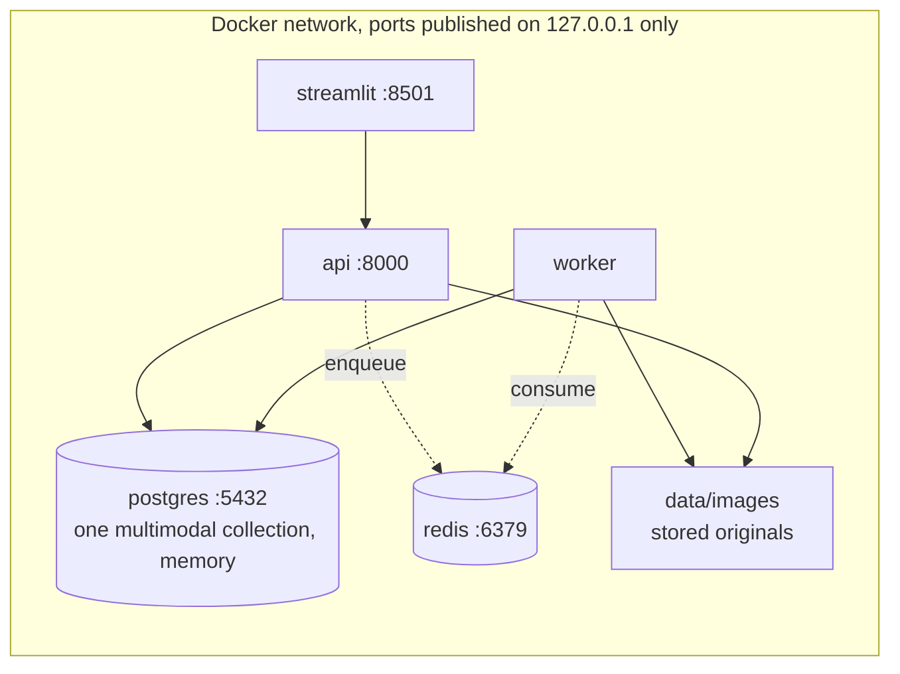
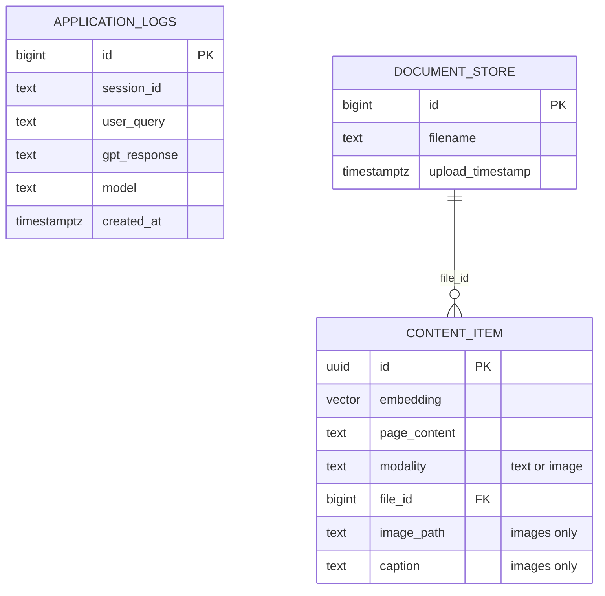
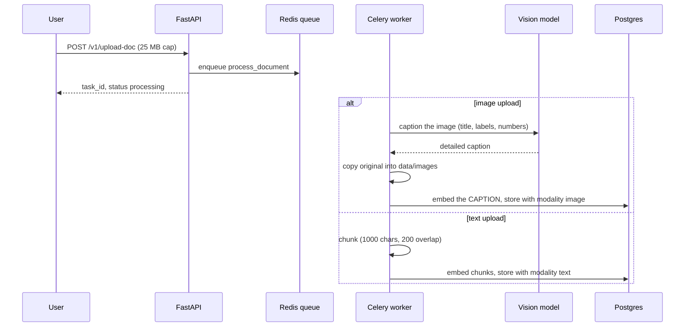
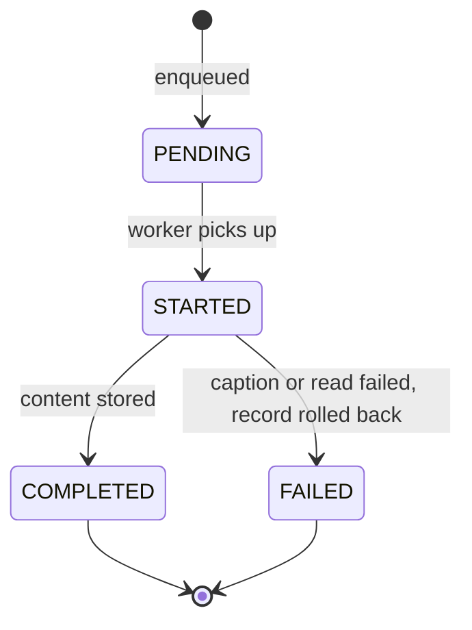
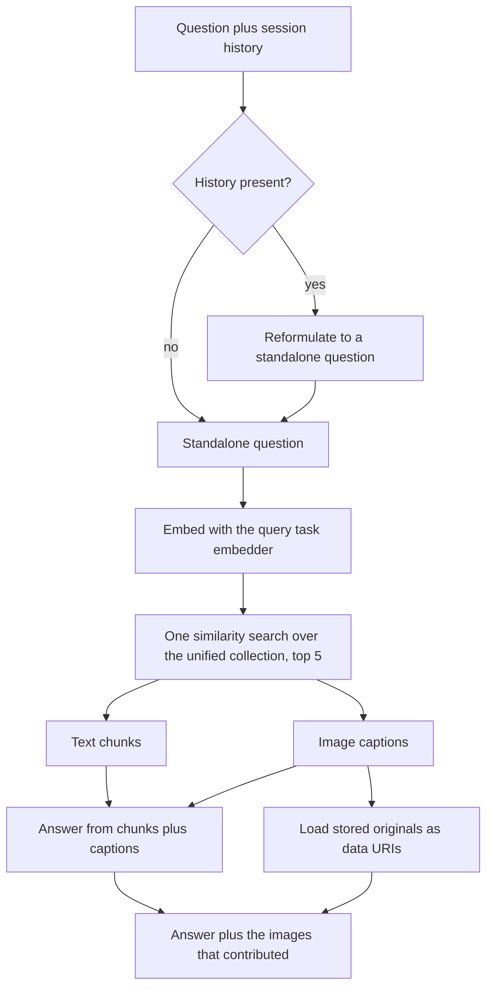
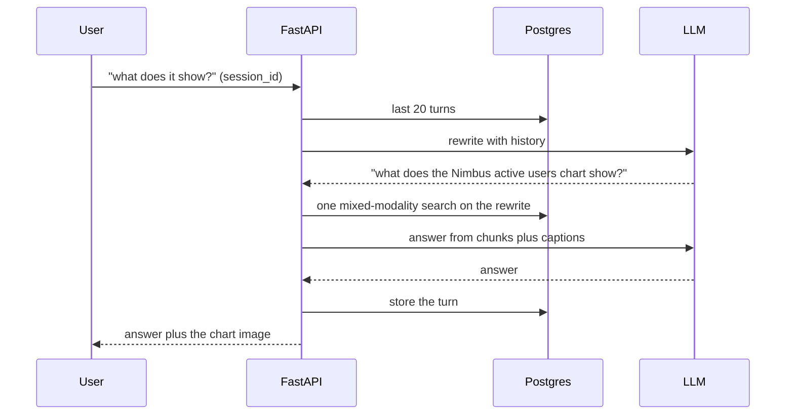

# rag-multimodal-2026

**Multimodal RAG: text and images are retrieved together from one vector space, and the images that grounded the answer are shown with it. The Multimodal (2026) rung of the RAG line.**

Part of the RAG line, a series of reference enterprise RAG implementations, one per retrieval strategy. This repository is the Multimodal (2026) rung. See [the full line](#the-rag-line) below.

[](https://github.com/mlvpatel/rag-multimodal-2026/actions/workflows/ci.yml)    


The clip above is a live, unedited run on local models. The question's answer lives in an image; the trace shows the mixed retrieval, and the image that grounded the answer appears under it. A full resolution screenshot is at [assets/screenshots/rag-multimodal-2026-ui.png](assets/screenshots/rag-multimodal-2026-ui.png). No paid keys were used.

## Contents

- [What makes it multimodal](#what-makes-it-multimodal)
- [Tech stack](#tech-stack)
- [Architecture](#architecture)
- [Data model](#data-model)
- [How ingestion works](#how-ingestion-works)
- [How a question is answered](#how-a-question-is-answered)
- [Memory](#memory)
- [The mathematics](#the-mathematics)
- [How to use](#how-to-use)
- [Configuration](#configuration)
- [API reference](#api-reference)
- [A note on access](#a-note-on-access)
- [Testing](#testing)
- [Project structure](#project-structure)
- [The RAG line](#the-rag-line)

## What makes it multimodal

Text only RAG is blind to everything in an image: the chart, the diagram, the screenshot, the scanned pricing card. This rung closes that gap with a caption-then-embed design:

| Stage | What happens |
|---|---|
| See | At index time a local vision model reads each image and writes a detailed caption, including any title, labels, and numbers |
| Unify | Text chunks and image captions are embedded into one pgvector collection, so they share a single search |
| Retrieve | One similarity search returns the most relevant items, text or image, for a question |
| Ground | The answer is generated from the retrieved text and image captions together |
| Show | The images that contributed are returned with the answer and displayed in the UI |

Two models, both local: a vision model captions images, and a text model answers. Keyless throughout.

Stated honestly, because it shapes what the system can and cannot do: the answering model reads captions, never pixels. A caption written at index time is what makes images searchable with a plain text embedder, and it is also the ceiling: a detail the captioner did not write down does not exist at query time. That is the deliberate trade against heavier designs (a joint image text embedding such as CLIP, or sending images to a vision capable answer model), which buy more fidelity at the cost of a second embedding space or per-question vision calls.

## Tech stack

| Component | Choice | Why this one |
|---|---|---|
| Vision captioner | moondream via Ollama | Small enough to run locally, good at charts and labels |
| API | FastAPI | Async, typed, OpenAPI for free |
| Vector store | pgvector on Postgres 16, one collection | One search over both modalities is the whole idea |
| Embeddings | Google gemini-embedding-001 or Ollama nomic-embed-text | Asymmetric task types: document map at index, query map at search |
| Generation | OpenAI, Anthropic, or Ollama | Routed by model name |
| Image serving | Base64 data URIs in the response | No separate file server; the UI renders inline |
| Memory | Postgres | Windowed history, reformulation before search |
| Ingestion | Celery + Redis | Captioning is slow, so it happens in the worker |
| UI | Streamlit | Chat surface that renders the retrieved images |
| CI | GitHub Actions | Lint, unit tests, pip-audit with no suppressions |

## Architecture

System context:



Containers:



## Data model



One table, two modalities, distinguished only by metadata. A text item's `page_content` is the chunk; an image item's `page_content` is its caption, and the metadata carries the path back to the stored original so the answer can show the real picture.

## How ingestion works



Task lifecycle:



## How a question is answered



On a question the content does not cover, neither modality returns the fact and the model says it does not have the information rather than inventing one.

## Memory

Turns are stored per `session_id` in Postgres, windowed to the last 20 turns. With history present the question is rewritten to be standalone before the search, so "what does it show?" arrives at the vector store as "what does the Nimbus active users chart show?".



## The mathematics

**Caption then embed.** An image $i$ becomes searchable text through the vision model $V$, and then a vector through the document embedder:

$$e_i = f_D\big(V(i)\big) \qquad e_c = f_D(c) \quad \text{for a text chunk } c$$

Both modalities land in the same space because both pass through the same $f_D$. That is what makes one search cover both, and it is also why the caption is the ceiling: retrieval can only match what $V$ wrote down.

**Asymmetric retrieval.** A query is embedded with the query task map $f_Q$, not $f_D$, and scored by cosine similarity against every item regardless of modality:

$$\text{top-}k = \underset{x \in \text{chunks} \cup \text{captions}}{\arg\,\text{top-}k}\; \frac{f_Q(q) \cdot e_x}{\lVert f_Q(q) \rVert\,\lVert e_x \rVert}$$

The two maps are trained so a question lands near its answer, not near its paraphrase. The store's own embedder runs at add time (documents), and search goes through the query embedder explicitly, which is what keeps the asymmetry honest with one shared collection.

**Mixed ranking.** Text and images compete in the same top $k = 5$: a question about a chart can fill its context with the chart's caption plus the surrounding prose, in whatever proportion similarity dictates. There is no per modality quota, which is a deliberate simplicity: the caption of a relevant image beats an irrelevant paragraph on similarity alone.

**Chunking, text only.** Text splits with size $c = 1000$ and overlap $o = 200$, giving $n \approx \lceil (L - o)/(c - o) \rceil$ chunks per document. Images never split: one image, one caption, one vector.

**Cost shape.** Vision runs once per image at index time, never per question. For a corpus with $m$ images and $n$ text chunks answering $Q$ questions:

$$\text{cost} = \underbrace{m \cdot c_{V} + (m + n) \cdot c_{\text{embed}}}_{\text{once, at ingest}} \;+\; \underbrace{Q \cdot \big(c_{\text{embed}} + c_{\text{LLM}}\big)}_{\text{per question, same as text only RAG}}$$

The multimodal capability is paid for at ingest, which is the right side of the ledger for read heavy workloads.

## How to use

### Local, fully offline with Ollama (no paid keys)

```bash
# 1. Data services
make db-up             # postgres with pgvector, plus redis

# 2. Ollama and the local models
ollama serve &
ollama pull nomic-embed-text
ollama pull qwen2.5:7b-instruct
ollama pull moondream          # the vision model that captions images

# 3. Install and run
make install
EMBEDDING_PROVIDER=ollama make dev        # API on :8000
make frontend                             # UI on :8501, second terminal
```

Ask a question whose answer lives in an image, and watch the image appear under the answer.

### Try it with the bundled sample data

The repo ships text documents in [sample_data](sample_data), an HR handbook, a product FAQ, and a real SEC 10-K excerpt, plus sample images in [sample_data/images](sample_data/images), including a pricing card and a usage chart. With the stack up:

```bash
make load-samples
```

Loading captions each image with the vision model, so the first load does real vision work. Then ask about the images, for example the price on the Nimbus Pro plan card, and about the text documents.

## Configuration

| Setting | Default | Meaning |
|---|---|---|
| EMBEDDING_PROVIDER | google | google or ollama |
| VLM_MODEL | moondream | The local vision model that captions images |
| TOP_K | 5 | How many items one question retrieves across both modalities |
| IMAGE_DIR | data/images | Where indexed images are stored for display |
| CHUNK_SIZE / CHUNK_OVERLAP | 1000 / 200 | Text chunking parameters |
| MAX_UPLOAD_MB | 25 | Uploads rejected above this size |
| ALLOWED_ORIGINS | http://localhost:8501 | CORS allowlist |

## API reference

| Method and path | Purpose | Limit |
|---|---|---|
| GET /health | Liveness | none |
| GET /metrics | Prometheus metrics | none |
| POST /v1/chat | Multimodal answer with the images that contributed | 60/min |
| POST /v1/upload-doc | Upload a document or image, queue indexing | 10/min, 25 MB |
| GET /v1/task/{task_id} | Poll indexing status | none |
| GET /v1/list-docs | List indexed documents and images | none |
| POST /v1/delete-doc | Delete a document or image and its content | none |

Answers that used images inline them as base64 data URIs, so responses carrying several large images are big; the upload cap is the practical bound on how big.

## A note on access

The service has no authentication, and that is a decision rather than an omission. It is a reference implementation meant to run on one machine: docker compose binds every published port, Postgres and Redis included, to `127.0.0.1`, and the containers run as a non-root user. A shipped default credential would be the worse option, since it reads as protection while sitting in a public repository. What remains is real: per route rate limiting, a hard size cap on uploads, HTML stripping on every question, and a narrow CORS origin. Put an authenticating gateway in front before exposing any of it beyond loopback.

## Testing

```bash
make test        # unit tests, no database or model needed
```

Unit tests cover the modality routing, that a follow-up is rewritten before the vector search sees it, that search embeds queries with the query task embedder and goes through the by-vector API (the store's own embedder is the document one), the windowed history query, and the API contract without credentials. The integration test proves an end to end grounded answer against a live Ollama.

## Project structure

```
src/multimodal/   the multimodal core: content store, vision captioner, engine
src/api/          FastAPI app, endpoints, Postgres memory
src/core/         config, LLM helpers, logging
src/embeddings/   asymmetric embedders and a plain text loader
src/worker/       Celery app and the indexing task
frontend/         Streamlit UI that shows retrieved images
sample_data/      runnable sample documents and images
tests/            unit and integration tests
docker/           Dockerfile and Compose stack
```

## The RAG line

This repo is the Multimodal (2026) rung. Each rung adds one idea and keeps the ones below it.

| Year | Repository | Strategy |
|---|---|---|
| 2022 | [rag-naive-2022](https://github.com/mlvpatel/rag-naive-2022) | Naive: one dense search over Chroma |
| 2023 | [rag-advanced-2023](https://github.com/mlvpatel/rag-advanced-2023) | Advanced: hybrid, RRF and cross encoder, in Python |
| 2023 | [rag-modular-2023](https://github.com/mlvpatel/rag-modular-2023) | Modular: pgvector, RRF in SQL, streaming, memory, evaluation |
| 2024 | [rag-graph-2024](https://github.com/mlvpatel/rag-graph-2024) | Graph: entity and triple knowledge graph linked into answers |
| 2024 | [rag-cache-2024](https://github.com/mlvpatel/rag-cache-2024) | Cache: no retrieval, corpus in context with a semantic cache |
| 2025 | [rag-agentic-2025](https://github.com/mlvpatel/rag-agentic-2025) | Agentic: bounded self correcting loop, confidence gated |
| 2026 | [rag-multiagent-2026](https://github.com/mlvpatel/rag-multiagent-2026) | Multi agent: supervisor, specialists, verifier |
| 2026 | rag-multimodal-2026, this repo | Multimodal: text and images in one vector space |

## Author

Malav Patel. GitHub [@mlvpatel](https://github.com/mlvpatel).

## License

Released under the MIT License. See [LICENSE](LICENSE).
