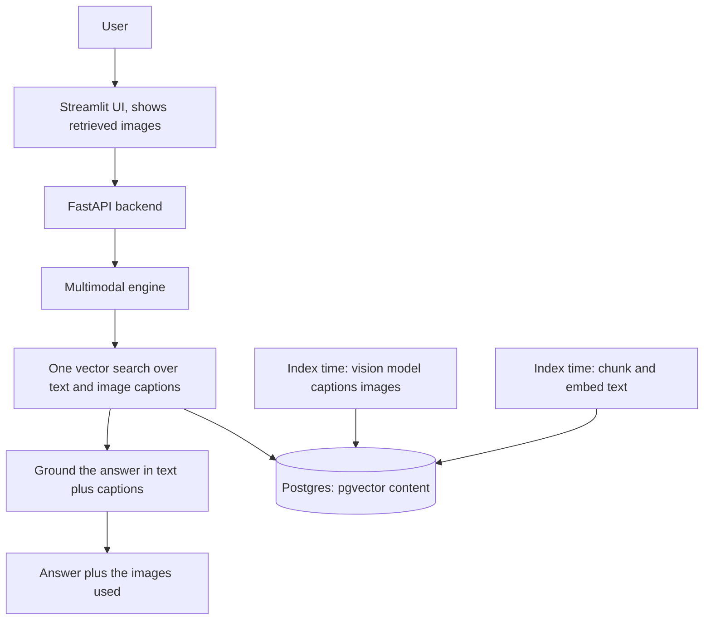

# rag-multimodal-2026

**Multimodal RAG. Retrieves across text and images at once, and shows the images it used to answer. The multimodal system in the RAG line.**

**Part of the RAG line, a series of reference enterprise RAG implementations. This repository is rag-multimodal-2026, Multimodal RAG.** See [the full line](#the-rag_naive-line) below.

rag-multimodal-2026 treats images as first class content. At index time a local vision model reads each image and writes a detailed caption, so images live in the same vector space as text chunks. A single search then returns the most relevant text and images together, the answer is grounded in both, and the images that contributed are returned and shown. It runs fully locally on Ollama at no cost.

[](https://github.com/mlvpatel/rag-multimodal-2026/actions/workflows/ci.yml)    


The clip above is a live, unedited run on local models. The question retrieves a chart image, the image is shown, and the answer is grounded in what the vision model read from it. A full resolution screenshot is at [assets/screenshots/rag_multimodal-ui.png](assets/screenshots/rag_multimodal-ui.png). No paid keys were used.

## What makes it multimodal

Text only RAG is blind to everything in an image: the chart, the diagram, the screenshot, the scanned page. rag-multimodal-2026 closes that gap.

| Stage | What happens |
|---|---|
| See | At index time a local vision model reads each image and writes a detailed caption, including any title, labels, and numbers |
| Unify | Text chunks and image captions are embedded into one pgvector collection, so they share a single search |
| Retrieve | One similarity search returns the most relevant items, text or image, for a question |
| Ground | The answer is generated from the retrieved text and image captions together |
| Show | The images that contributed are returned with the answer and displayed in the UI |

Two models, both local: a vision model captions images, and a text model answers. Keyless throughout.

## How a question is answered

The question runs through one vector search over the unified collection, returning the top text chunks and image captions. The answer is generated strictly from that retrieved content. Any images among the results are returned with the answer so the UI can show them. On a question the content does not cover, the model answers honestly that it does not have the information rather than inventing one.

## Features

| Area | Capability |
|---|---|
| Multimodal retrieval | Text chunks and image captions in one vector space, searched together |
| Vision at index time | A local vision model captions images so they become searchable |
| Images in the answer | The images that grounded the answer are returned and shown |
| Models | Text answers via OpenAI, Anthropic, or local Ollama; images via a local vision model |
| Grounded first | Answers strictly from the retrieved text and images |
| Observability | The trace shows how many text and image items were retrieved, and the sources |
| Memory | Multi turn sessions stored in Postgres |
| Security | API key auth, rate limiting, input sanitization, CORS |
| Packaging | Docker Compose, Prometheus metrics, tests, CI |

## Architecture



## How to use

### Local, fully offline with Ollama (no paid keys)

```bash
# 1. Data services
make db-up             # postgres with pgvector, plus redis

# 2. Ollama and the local models
ollama serve &
ollama pull nomic-embed-text
ollama pull qwen2.5:7b-instruct
ollama pull moondream          # the vision model that captions images

# 3. Install and run
make install
EMBEDDING_PROVIDER=ollama make dev        # API on :8000
make frontend                             # UI on :8501, second terminal
```

Ask a question whose answer lives in an image, and watch the image appear under the answer.

## Try it with the bundled sample data

The repo ships text documents in [sample_data](sample_data), an HR handbook, a product FAQ, and a real SEC 10-K excerpt, plus sample images in [sample_data/images](sample_data/images), including a pricing card and a usage chart. With the stack up:

```bash
make load-samples
```

Loading captions each image with the vision model, so the first load does real vision work. Then ask about the images, for example the price on the Nimbus Pro plan card, and about the text documents.

## Configuration

| Setting | Default | Meaning |
|---|---|---|
| EMBEDDING_PROVIDER | google | google or ollama |
| VLM_MODEL | moondream | the local vision model that captions images |
| TOP_K | 5 | how many text and image items one question retrieves |
| IMAGE_DIR | data/images | where indexed images are stored for display |
| API_KEY | change_me | required in the X-API-Key header |

## API reference

| Method and path | Purpose |
|---|---|
| GET /health | Liveness, no auth |
| POST /v1/chat | Multimodal answer with the images that contributed |
| POST /v1/upload-doc | Upload a document or image and index it |
| GET /v1/list-docs | List indexed documents and images |
| POST /v1/delete-doc | Delete a document or image and its content |
| GET /metrics | Prometheus metrics |

## Testing

```bash
make test        # unit tests, no database or model needed
```

Unit tests cover the API contract, the config, the indexing task, and the modality routing, with the model and database mocked. The integration test proves an end to end grounded answer against a live Ollama.

## Project structure

```
src/multimodal/   the multimodal core: content store, vision captioner, engine
src/api/          FastAPI app, endpoints, security, Postgres memory
src/core/         config, LLM helpers, logging
src/embeddings/   the embedder and a plain text loader
frontend/         Streamlit UI that shows retrieved images
sample_data/      runnable sample documents and images
tests/            unit and integration tests
docker/           Dockerfile and Compose stack
```

## The RAG line

This repo is the Multimodal (2026) rung. Each rung adds one idea and keeps the ones below it.

| Year | Repository | Strategy |
|---|---|---|
| 2022 | [rag-naive-2022](https://github.com/mlvpatel/rag-naive-2022) | Naive: one dense search over Chroma |
| 2023 | [rag-advanced-2023](https://github.com/mlvpatel/rag-advanced-2023) | Advanced: hybrid, RRF and cross encoder, in Python |
| 2023 | [rag-modular-2023](https://github.com/mlvpatel/rag-modular-2023) | Modular: pgvector, RRF in SQL, streaming, memory, evaluation |
| 2024 | [rag-graph-2024](https://github.com/mlvpatel/rag-graph-2024) | Graph: entity and triple knowledge graph linked into answers |
| 2024 | [rag-cache-2024](https://github.com/mlvpatel/rag-cache-2024) | Cache: no retrieval, corpus in context with a semantic cache |
| 2025 | [rag-agentic-2025](https://github.com/mlvpatel/rag-agentic-2025) | Agentic: bounded self correcting loop, confidence gated |
| 2026 | [rag-multiagent-2026](https://github.com/mlvpatel/rag-multiagent-2026) | Multi agent: supervisor, specialists, verifier |
| 2026 | rag-multimodal-2026, this repo | Multimodal: text and images in one vector space |

## Author

Malav Patel. GitHub @mlvpatel.

## License

Released under the MIT License. See [LICENSE](LICENSE). MIT is the simplest and most permissive of the common licenses, so anyone can read, run, modify, and reuse the code freely.
